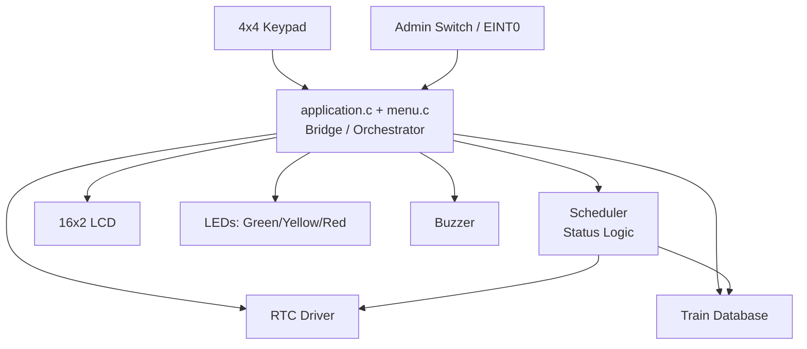
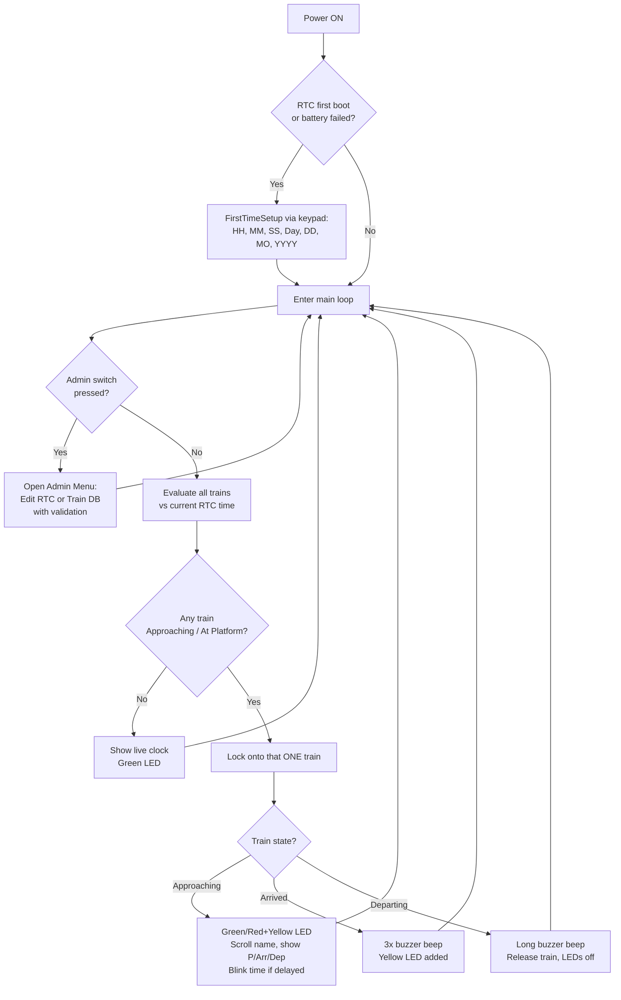

# Smart Railway Platform Clock & Announcement Controller

An embedded system built on the **NXP LPC2148 (ARM7TDMI-S)** microcontroller that automates railway platform information management — live clock display, train schedule tracking, delay indication, and automatic passenger announcements — reducing manual intervention and improving accuracy.

---

## 1. Project Overview / Purpose

### Objective
Railway platforms traditionally depend on manual clock-setting and manual PA announcements for train arrivals, delays, and departures. This project automates that entire workflow using a low-cost, standalone embedded controller.

### Business Problem Addressed
- Manual announcement systems are error-prone and depend on staff availability.
- Passengers often lack real-time, accurate information about delays.
- Small/medium stations cannot justify the cost of a full computerized display system.

### Scope
The controller independently:
- Maintains accurate time via a battery-backed Real-Time Clock (RTC), persisting across power cycles.
- Stores and tracks a small train database (3 trains in the current build, extensible).
- Automatically detects when a train is approaching or has arrived at the platform and displays/announces it.
- Allows an authorized admin to update the clock or train schedule on the fly via a keypad-driven menu, protected behind a physical interrupt switch.

---

## 2. Features and Functionality

| Feature | Description |
|---|---|
| **Battery-backed RTC** | Time/date is set once (first boot) and persists across power cycles via VBAT + 32.768 kHz crystal. |
| **Live Clock Display** | 16×2 LCD shows current time, day, and date when no train needs attention. |
| **Train Database** | Stores train number, name, platform, scheduled/updated arrival & departure time, and delay (minutes) for multiple trains. |
| **Automatic Train Detection** | Continuously compares RTC time against each train's schedule to determine status: On-Time, Approaching, At Platform, or Departed. |
| **Dynamic Announcement Display** | Line 1 shows the train number (fixed) with the train name scrolling; Line 2 alternates between platform/arrival/departure info and the live clock. |
| **LED Status Indication** | Green = on-time / all clear, Yellow = at platform, Red = delayed — reflecting the currently active train's real status. |
| **Buzzer Alerts** | Three short beeps on arrival, one long beep on departure; duration is tunable. |
| **Admin Menu (Keypad + Interrupt)** | A hardware interrupt switch opens a menu (protected, not accessible accidentally) to edit RTC time/date or any train's schedule fields individually. |
| **Input Validation** | Every numeric field (hours 0–23, minutes/seconds 0–59, date 1–31, month 1–12, etc.) is range-checked; invalid entries are rejected and re-prompted. |
| **Live Input Echo & Backspace** | Digits appear on the LCD as they are typed; `D` backspaces, `#` confirms and moves to the next field, `*` saves and exits immediately, `C` cancels without applying any change. |
| **First-Time Setup Wizard** | On genuinely first boot (or after a battery/backup failure), the system walks the admin through setting time, day, and date once. |

---

## 3. Repository / Folder Structure

```
Smart Railway Platform Clock & Announcement Controller/
├── inc/                      # Header files (declarations, macros, pin maps)
│   ├── types.h                # Custom type aliases (u8, u16, u32, s8, s32, f32)
│   ├── defines.h               # Generic bit-manipulation macros
│   ├── delay.h / delay.c       # Software delay routines (ms/us)
│   ├── KPM_defines.h           # Keypad pin/port definitions
│   ├── kpm_v2.h                # Keypad driver interface
│   ├── eint_sw.h               # Admin switch / EINT0 interrupt interface
│   ├── Rtc.h                   # RTC driver interface + clock-prescaler math
│   ├── train_db.h              # Train record structure + database API
│   ├── indicator.h             # LED + buzzer driver interface
│   ├── lcd.h / lcddefines.h    # LCD driver interface + HD44780 command set
│   ├── scheduler.h             # Train-state evaluation interface
│   └── menu.h                  # Admin menu interface
│
├── src/                      # Source files (implementations)
│   ├── kpm_v2.c                 # 4×4 matrix keypad scanning driver
│   ├── eint_sw.c                # EINT0 ISR + admin-flag handling
│   ├── Rtc_v2.c                 # RTC init (battery-aware), get/set/display
│   ├── train_db.c               # Train database (seed data + accessors)
│   ├── indicator.c              # LED / buzzer GPIO control
│   ├── lcd_v2.c                 # 16×2 LCD low-level driver
│   ├── scheduler.c              # Compares RTC vs train DB, computes status
│   ├── menu.c                   # Admin menu, field-editing UI, validation
│   └── application.c            # main() — integrates every module
│
├── Startup.s                 # Keil-generated ARM startup / vector table
└── README.md                 # This file
```

**Module dependency direction:** `application.c` (top) → `menu.c` / `scheduler.c` (bridge) → `kpm_v2.c`, `eint_sw.c`, `Rtc_v2.c`, `train_db.c`, `indicator.c`, `lcd_v2.c` (independent hardware drivers). Drivers never call each other directly — only the bridge layer coordinates them.

---

## 4. Block Diagram



---

## 5. Flow Chart — End-to-End Operation



---

## 6. Hardware Details

| Component | Purpose | Notes |
|---|---|---|
| **LPC2148** (ARM7TDMI-S) | Main controller | 512 KB Flash, 32 KB RAM, onboard RTC with VBAT support |
| **16×2 LCD (HD44780-compatible)** | Display | 8-bit interface, D0–D7 on P0.8–P0.15, RS/RW/E on P0.16–P0.18 |
| **4×4 Matrix Keypad** | Admin input | Rows P1.16–P1.19, Columns P1.20–P1.23 (pull-ups required) |
| **12 MHz crystal** | Main system clock | Drives PLL → 60 MHz CCLK |
| **32.768 kHz crystal** | RTC clock | Connected to RTCX1/RTCX2, enables accurate 1 Hz timekeeping |
| **CMOS backup battery (VBAT)** | RTC persistence | Keeps RTC running across power cycles — **requires a genuine LPC2148** (some family members such as LPC2129 lack VBAT/RTC-crystal support) |
| **3× LED (Green/Yellow/Red)** | Status indication | P0.2–P0.4 |
| **Buzzer** | Audible alerts | P0.5 |
| **Push-button (Admin switch)** | Triggers EINT0 | P0.1, pull-up + switch-to-GND, falling-edge interrupt |

> **Hardware photos:** _Add board photos, wiring closeups, and the final assembled setup here (e.g. `docs/images/board.jpg`, `docs/images/wiring.jpg`)._

---

## 7. Application Screenshots / Results

> _Add screenshots/photos here of:_
> - _Boot self-test (LED/buzzer cycle)_
> - _First-time setup prompts on the LCD_
> - _Normal clock display_
> - _Train announcement screen (approaching / at platform)_
> - _Admin menu screens (RTC edit, train edit)_
> - _Proteus simulation schematic (if used for pre-hardware validation)_

---

## 8. Testing Instructions

### 8.1 Setup
1. Build the project in Keil µVision with **Device = LPC2148** (verify under *Project → Options for Target → Device* — do **not** leave it on LPC2129 or another family member; memory size and peripheral behavior differ).
2. Flash the generated `.hex` via Flash Magic (or your programmer of choice) onto the actual LPC2148 board.
3. Confirm hardware: 12 MHz main crystal, 32.768 kHz RTC crystal, VBAT battery connected, keypad pull-ups in place.

### 8.2 Test Cases

| # | Test | Steps | Expected Result |
|---|---|---|---|
| 1 | Boot self-test | Power on | Green → Yellow → Red LED cycle, one buzzer beep |
| 2 | First-time RTC setup | Power on with a fresh/blank RTC | Keypad prompts for HH/MM/SS/Day/DD/MO/YYYY in sequence |
| 3 | RTC persistence | Set time, power OFF, power ON again | Time continues from where it left off — **no** re-prompt |
| 4 | Live clock display | Idle state | LCD shows HH:MM:SS, Day, DD/MM/YYYY, updating every second |
| 5 | Train approaching | Set RTC close to a train's arrival time | LCD switches to that train's info; LED reflects on-time/delayed status |
| 6 | Train arrival | Let RTC reach the train's arrival time | 3x buzzer beep, Yellow LED added |
| 7 | Train departure | Let RTC reach the train's departure time | Long buzzer beep, LEDs reset, returns to idle clock |
| 8 | Admin menu — RTC edit | Press admin switch → A → field choice | Current value shown, new value typed is echoed live, validated on save |
| 9 | Admin menu — Train edit | Press admin switch → B → train → field | Same live-echo/validation behavior for platform/delay/arrival/departure |
| 10 | Invalid input handling | Enter e.g. Hour = 25 | "Invalid! Range: 0-23" shown, same field re-asked |
| 11 | Cancel mid-edit | Press `C` at any field | No values are written; returns to normal display unchanged |

### 8.3 Simulation (Optional Pre-Hardware Validation)
Proteus can be used for early logic testing with an **LPC2124** substitute (LPC2148 is not in the default Proteus library; pinout/registers are compatible for GPIO/RTC/LCD/keypad, **except EINT0**, which is on P0.16 on the Proteus LPC2124 model vs P0.1 on real LPC2148 — see Troubleshooting).

---

## 9. Troubleshooting Guidelines

| Symptom | Likely Root Cause | Resolution |
|---|---|---|
| Garbled/corrupted LCD text after `CLEAR_LCD` | HD44780 needs ~1.6 ms to execute a clear/home command; code only waited ~100 µs | Add `delay_ms(2)` after every `CLEAR_LCD` / `RETURN_CUR_HOME` call (already built into `CMD_TO_LCD()`) |
| Keypad keys don't match expected characters in **Proteus simulation** | Wrong keypad part used (`KEYPAD-SMALLCALC`, a calculator layout, instead of a standard hex keypad) | Replace with the plain `KEYPAD` component (1–9, A–D, *, #) |
| Admin switch does nothing in **Proteus simulation** only | Proteus's LPC2124 substitute maps EINT0 to P0.16, not P0.1 (real LPC2148 uses P0.1, confirmed via official reference code) | Known simulation-only limitation — verify on real LPC2148 hardware, where P0.1 is correct |
| RTC sometimes skips first-time setup / sometimes re-asks every boot | (a) CCR register read too early before crystal stabilizes, (b) VBAT/crystal not reliably wired, (c) **chip is actually not an LPC2148** | Add a settle delay before checking `CCR`; sanity-check date/time ranges as a second signal; verify the physical chip's printed part number — some family members (e.g. **LPC2129**) do not have VBAT/RTC-crystal support at all |
| LCD shows overlapping/garbled text when switching between clock and train-info screens | Screen not cleared before writing shorter text over a longer previous screen | Always `CLEAR_LCD` before switching display "modes"; keep Line 1 and Line 2 updates independent where one line's content changes more often than the other |
| Admin menu occasionally opens by itself right after power-on | Switch/EINT0 pin noise at power-on triggering a spurious interrupt before the pull-up settles | Explicitly clear the admin flag once after all boot-time initialization, right before entering the main loop |
| System appears to "freeze" showing only train info, clock never appears | Blocking display loop for train announcements never yields back to the clock-display code path | Interleave clock display and train announcement on a fixed cycle (or a non-blocking tick-based scheduler) rather than looping exclusively in one mode |

---

## 10. Real-Time Use Cases

- **Railway platforms** (primary use case): small/unmanned stations needing automated, low-cost passenger information without a full computerized display network.
- **Bus terminals**: same arrival/departure/delay announcement pattern applies directly.
- **Airport gate displays** (small scale): boarding time approaching, gate status, delay flagging.
- **Factory/warehouse shift & shuttle announcements**: internal transport schedule tracking using the same RTC-vs-schedule comparison logic.
- **Classroom/exam hall bell-timing systems**: repurposing the RTC + scheduled-event + buzzer/LED core for period/exam timing alerts.

---

## 11. Notes for Maintainers

- Each hardware driver (`kpm_v2`, `eint_sw`, `Rtc`, `indicator`, `lcd`) is intentionally kept "dumb" — it only talks to its own peripheral and exposes simple functions. All decision-making (when to show what, when to sound the buzzer) lives in `scheduler.c` / `menu.c` / `application.c`.
- `TOTAL_TRAINS` in `train_db.h` can be increased to track more trains; no other file needs to change for that.
- If porting to a different LPC21xx part, re-verify: VBAT/RTC-crystal support, EINT0 pin mapping, and flash/RAM sizes in the Keil device settings before assuming compatibility.
