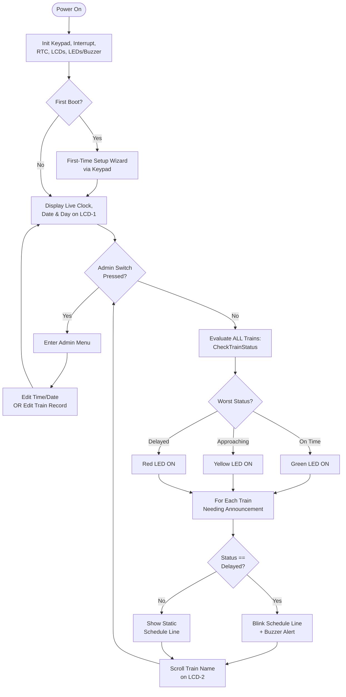

# 🚉 Smart Railway Platform Clock & Announcement Controller

An embedded systems project built on the **NXP LPC2148 (ARM7TDMI-S)** microcontroller that functions as an automated railway platform display — showing live date/time, upcoming train schedules, delay status, and audio-visual alerts, with an admin mode for on-site schedule editing.

---

## 📑 Table of Contents

1. [Project Overview / Purpose](#-project-overview--purpose)
2. [Features and Functionality](#-features-and-functionality)
3. [Repository Structure](#-repository-structure)
4. [System Architecture (Block Diagram)](#-system-architecture-block-diagram)
5. [Flow Chart](#-flow-chart)
6. [Hardware Details and Images](#-hardware-details-and-images)
7. [Circuit Diagram](#-circuit-diagram)
8. [Software Setup & Build Instructions](#-software-setup--build-instructions)
9. [Admin Mode — Usage Guide](#-admin-mode--usage-guide)
10. [Testing Instructions](#-testing-instructions)
11. [Troubleshooting Guidelines](#-troubleshooting-guidelines)
12. [Real-Time Use Cases](#-real-time-use-cases)
13. [Application Screenshots / Results](#-application-screenshots--results)
14. [Project Submission Checklist](#-project-submission-checklist)
15. [Author](#-author)

---

## 🎯 Project Overview / Purpose

### Objective
At most small and mid-sized railway stations, platform information (arrival/departure times, delays, platform changes) is either updated manually on physical boards or not updated in real time at all, leading to passenger confusion and missed trains. This project implements a **low-cost, standalone embedded controller** that automatically manages a railway platform's clock and train-announcement display without depending on a central server, network connection, or manual paperwork.

### Business Problem Addressed
- Manual platform boards are slow to update and prone to human error.
- Passengers have no immediate visual/audio cue when a train is delayed or approaching.
- Station staff need a simple way to update schedule data on the spot (e.g., after a delay is reported) without specialized software or a laptop.

### Scope
The system is a **single-station, single-platform prototype** that:
- Maintains the current date/time using an on-chip RTC (independent of external time sources).
- Stores and manages a small table of trains (`TOTAL_TRAINS = 3` in the current build, easily extendable).
- Automatically evaluates each train's status (on-time / approaching / delayed) every cycle and reflects it through LEDs, an LCD, and a buzzer.
- Provides a keypad + push-button based **Admin Mode** so station staff can update train timing, platform number, and delay minutes, or correct the system date/time, without any PC connection.
- Is designed to be reproducible on standard LPC2148 prototyping hardware, making it suitable as an academic embedded-systems demonstration as well as a proof-of-concept for low-cost station automation.

**Out of scope (by design, for this prototype):** multi-platform support, wireless schedule updates, integration with live railway APIs, and voice-based announcements (a buzzer + scrolling text is used as a stand-in for a public address system).

---

## ✨ Features and Functionality

| Feature | Description |
|---|---|
| **Live Clock & Calendar Display** | LCD-1 shows the current time (HH:MM:SS), day of week, and date (DD/MM/YYYY), sourced from the LPC2148's on-chip RTC. |
| **Automatic Train Status Evaluation** | Every cycle, the firmware computes each train's status by comparing the RTC time against the train's arrival time and stored delay value. |
| **3-Level Status Indication (LEDs)** | 🟢 Green = On Time, 🟡 Yellow = Approaching (within a configurable threshold), 🔴 Red = Delayed. The LED reflects the *worst* status among all trains. |
| **Dynamic Train Information Display** | LCD-2 shows the train number, a horizontally scrolling train name, platform number, and arrival/departure time for any train that is approaching or delayed. |
| **Delay Alerts** | When a train is delayed, its schedule line blinks on/off automatically to draw attention, in addition to the red LED. |
| **Buzzer Alert** | An active buzzer sounds to audibly flag approaching/delayed trains, complementing the visual scrolling announcement. |
| **Admin Edit Mode (Interrupt-Driven)** | Pressing a dedicated push-button fires an external hardware interrupt (EINT0) that immediately pauses normal display operation and opens an on-device menu — no need to reboot or reflash. |
| **Keypad-Based Data Entry** | A 4x4 matrix keypad is used to type numeric values (with live LCD echo and backspace support) for editing time, date, and train records. |
| **Editable Train Records** | Per train: platform number, delay (minutes), and arrival/departure hour & minute can all be updated from the Admin Menu. |
| **Editable System Clock** | Admin can correct the RTC's time and date directly from the keypad. |
| **First-Time Setup Wizard** | On the very first power-up (fresh RTC), the system automatically walks through a guided setup for time, day, and date before entering normal operation. |
| **Non-Volatile Timekeeping** | Because the RTC is on-chip and battery-backed (hardware dependent), time keeps running correctly across power cycles once set. |
| **Serial Programming Interface** | A DB9 connector is provided for UART-based firmware flashing/communication with a PC during development. |

---

## 📁 Repository Structure

```
Smart-Railway-Platform-Clock-Announcement-Controller/
│
├── inc/                         # Header files (interfaces & constants)
│   ├── defines.h                # Generic bit/byte/nibble macro utilities
│   ├── delay.h                  # Software delay function prototypes
│   ├── eint_sw.h                # External interrupt (admin switch) config & ISR prototype
│   ├── indicator.h               # LED & buzzer pin definitions and function prototypes
│   ├── KPM_defines.h             # 4x4 keypad row/column pin mapping
│   ├── kpm_v2.h                  # Keypad scanning driver interface
│   ├── lcd.h                     # LCD driver function prototypes
│   ├── lcddefines.h              # LCD command/pin definitions (RS, RW, EN, data bus)
│   ├── menu.h                    # Admin menu & first-time setup prototypes
│   ├── Rtc.h                     # On-chip RTC driver interface & clock constants
│   ├── scheduler.h               # Train status evaluation logic & thresholds
│   └── train_db.h                # Train record structure (TrainInfo_t) & DB prototypes
│
├── src/                         # Source files (implementation)
│   ├── application.c             # main() — system loop, display sequencing, announcements
│   ├── delay.c                   # Delay routine implementation
│   ├── eint_sw.c                 # External interrupt init & ISR (sets admin_Edit_Flag)
│   ├── indicator.c                # LED/buzzer init & control functions
│   ├── kpm_v2.c                   # Keypad scan implementation
│   ├── lcd_v2.c                   # LCD initialization & character/command write routines
│   ├── menu.c                     # Admin Menu, InputField() editor, FirstTimeSetup()
│   ├── Rtc_v2.c                   # RTC init, get/set time, date, and day-of-week
│   ├── scheduler.c                # CheckTrainStatus() — on-time/approaching/delayed logic
│   └── train_db.c                 # Train database storage & accessor/mutator functions
│
├── images/                      # Diagrams, hardware photos, and result screenshots
│   ├── BD.png                     # System block diagram
│   ├── Circuit.jpeg               # Circuit/schematic diagram
│   ├── hardware/                  # (Add) Photographs of the assembled hardware setup
│   └── results/                   # (Add) LCD output photos / demo screenshots
│
└── README.md                    # Project documentation (this file)
```

### Key Files at a Glance
| File | Why it matters |
|---|---|
| `src/application.c` | Entry point — controls the overall state machine (clock display → status evaluation → announcement → admin mode). |
| `src/scheduler.c` | The "brain" of delay/approaching detection — modify `APPROACHING_THRESHOLD` here to change sensitivity. |
| `inc/train_db.h` | Change `TOTAL_TRAINS` here to scale the schedule up or down. |
| `src/menu.c` | All admin-facing data entry logic (time/date/train editing) lives here. |
| `src/Rtc_v2.c` | Low-level RTC register configuration — the source of truth for all timing. |

---

## 🧩 System Architecture (Block Diagram)


**Signal flow:**
- **Inputs** → Admin Edit Switch (external interrupt), 4x4 Matrix Keypad, on-chip RTC, and the train schedule table stored in MCU memory.
- **Processing (LPC2148)** → reads the RTC, compares it against the schedule, updates both LCDs, detects delays, drives the LED/buzzer indicators, and handles admin configuration.
- **Outputs** → LCD-1 (clock & date), LCD-2 (train information), 3 status LEDs, and a buzzer.
- A DB9 serial connector is used to program/communicate with the board from a PC during development.

---

## 🔄 Flow Chart

End-to-end process flow of the firmware's main loop:



**Data movement summary:**
1. RTC → `CheckTrainStatus()` (compares current time vs. each train's arrival time + stored delay).
2. Train DB (`TrainInfo_t[]`) → status logic and LCD-2 rendering.
3. Status result → LED driver (worst-case status wins) and LCD-2 announcement logic.
4. Admin switch interrupt → `admin_Edit_Flag` → breaks the main loop into `AdminMenu()`, which writes back into the RTC and Train DB.

---

## 🔧 Hardware Details and Images

| Component | Quantity | Role in the System | Notes |
|---|---|---|---|
| LPC2148 (ARM7TDMI-S) development board | 1 | Core controller — runs all firmware logic | 40 MHz crystal typical; `FOSC = 12 MHz`, `CCLK = 5×FOSC` in this build |
| 16x2 Character LCD (LM016L) | 2 | LCD-1: Clock/date · LCD-2: Train info | 8-bit parallel interface |
| 4x4 Matrix Keypad | 1 | Admin data entry (digits 0–9, and A/B/C/D/*/# as menu controls) | Connected to Port 1 |
| Push-Button Switch | 1 | Triggers Admin Mode via external interrupt (EINT0) | Connected to P0.1 |
| LEDs — Green, Yellow, Red | 3 | Visual train-status indication | P0.2 / P0.3 / P0.4 |
| Active Buzzer | 1 | Audible delay alert | P0.5 |
| DB9 Serial Connector | 1 | UART link for PC ↔ MCU programming/debugging | Used with Flash Magic or similar |
| Regulated 5V DC Power Supply | 1 | Powers the board and peripherals | |

> 📷 **Add photographs of your assembled hardware here** — e.g., `images/hardware/full_setup.jpg`, `images/hardware/lcd_display.jpg`, `images/hardware/keypad_wiring.jpg` — with a short caption for each describing what is shown (top view, wiring close-up, powered-on demo, etc.).

---

## 🔌 Circuit Diagram


### Pin Mapping (LPC2148 / LPC2124 core)

| Peripheral | Function | MCU Pin |
|---|---|---|
| Admin Edit Switch | External Interrupt (EINT0) | P0.1 (SW) |
| Buzzer | Delay alert | P0.5 |
| Green LED | On-time status | P0.2 |
| Yellow LED | Approaching status | P0.3 |
| Red LED | Delayed status | P0.4 |
| LCD Data Bus (D0–D7) | 8-bit data | P0.8 – P0.15 |
| LCD RS | Register Select | P0.16 |
| LCD RW | Read/Write | P0.17 |
| LCD EN | Enable | P0.18 |
| Keypad Rows (R0–R3) | Row scan | P1.16 – P1.19 |
| Keypad Columns (C0–C3) | Column scan | P1.20 – P1.23 |

---

## 🛠️ Software Setup & Build Instructions

**Tools required:**
- **MCU:** NXP LPC2148 / LPC2124 (ARM7TDMI-S)
- **IDE / Toolchain:** Keil µVision (ARM) or equivalent LPC21xx-compatible toolchain
- **Flash Utility:** Flash Magic (via UART/DB9 serial connector)
- **Language:** Embedded C

**Steps:**
1. Clone this repository.
2. Open the project in Keil µVision (or your preferred ARM toolchain), adding all files from `inc/` (include path) and `src/` (source files) to a new LPC2148 project.
3. Build the project to generate a `.hex` file.
4. Connect the board to the PC via the DB9 serial connector, and put the board into ISP/bootloader mode as per your board's instructions.
5. Use Flash Magic (or an equivalent LPC21xx flashing tool) to flash the generated `.hex` file onto the LPC2148.
6. Power the board with a regulated 5V DC supply.
7. On first boot, follow the **First-Time Setup** prompts on LCD-1 to enter the current time, day, and date using the keypad.

---

## 👨‍💼 Admin Mode — Usage Guide

1. Press the **Admin Edit Switch** at any time — this fires the external interrupt and immediately opens the Admin Menu (interrupts any ongoing display or announcement).
2. Choose an option on the keypad:
   - **`A`** → Edit Time & Date (enter HH → MM → SS → DD → MO → YYYY)
   - **`B`** → Edit a Train Record (select train 1–3, then enter Platform → Delay-min → Arr HH → Arr MM → Dep HH → Dep MM)
3. While typing any field:
   - Digits **0–9** are echoed live on LCD-2.
   - **`D`** acts as backspace.
   - **`#`** confirms the current field and moves to the next one.
   - **`*`** finishes editing early, keeping all fields entered so far and skipping the rest.
   - **`C`** cancels the entire edit operation for that record (no values are written).
4. Leaving any numeric field blank and pressing its terminator key keeps that field's previous value unchanged.
5. Once complete, the system displays a confirmation (`Time Updated!`, `Date Updated!`, or `Train Updated!`) and automatically returns to normal clock/announcement display.

---

## 🧪 Testing Instructions

### Test Setup
1. Flash the firmware as described in [Software Setup & Build Instructions](#-software-setup--build-instructions).
2. Power the board and confirm both LCDs initialize (backlight on, no garbled characters).
3. Complete the First-Time Setup wizard with a known reference time/date (e.g., from your phone) so results are verifiable.

### Test Case Matrix

| # | Test Case | Steps | Expected Result |
|---|---|---|---|
| 1 | Power-on / first boot | Power the board for the first time (blank RTC) | "FIRST TIME SETUP" prompt appears; system accepts HH/MM/SS, day, DD/MM/YYYY via keypad |
| 2 | Live clock accuracy | Let the system run for 5–10 minutes; compare LCD-1 time against a reference clock | Time on LCD-1 matches reference within a few seconds; date and day are correct |
| 3 | On-time status | Set a train's arrival time more than `APPROACHING_THRESHOLD` minutes in the future, with delay = 0 | Green LED ON; no announcement/blinking for that train |
| 4 | Approaching status | Set a train's arrival time within the approaching threshold (e.g., 1–2 minutes ahead), delay = 0 | Yellow LED ON (unless another train is delayed); LCD-2 shows that train's info with scrolling name; no blink |
| 5 | Delayed status | Use Admin Menu (`B`) to set a train's `delayMinutes` > 0 | Red LED ON; LCD-2 schedule line blinks on/off repeatedly; buzzer/scrolling announcement triggers |
| 6 | Multiple trains, worst-status LED | Configure one train on-time and another delayed | Red LED (worst status) is shown; only the delayed/approaching train(s) are announced |
| 7 | Admin switch interrupt | Press the Admin Edit Switch while the clock or an announcement is being displayed | Display immediately halts and the Admin Menu appears, regardless of what was on-screen |
| 8 | Edit time/date (`A`) | From Admin Menu, choose `A`, enter new HH/MM/SS then DD/MO/YYYY, confirm each with `#` | RTC updates; "Time Updated!" then "Date Updated!" shown; LCD-1 reflects new values afterward |
| 9 | Edit train record (`B`) | Choose `B`, select a train number, update platform/delay/arrival/departure fields | "Train Updated!" shown; subsequent status evaluation reflects the new values |
| 10 | Cancel mid-edit (`C`) | Start editing any field, press `C` | "...Cancelled" message shown; no values are changed in RTC or Train DB |
| 11 | Early finish (`*`) | Start editing a multi-field record, press `*` partway through | Fields entered so far are saved; remaining fields keep their previous values |
| 12 | Backspace (`D`) | While typing a numeric field, press a few digits then `D` | Last digit is removed from the LCD echo and from the value being built |
| 13 | Invalid train number | In Admin Menu `B`, enter a train number outside 1–`TOTAL_TRAINS` | "Invalid Train No" message shown; returns to normal mode without changes |
| 14 | Power-cycle persistence | Power the board off and on again after normal (non-first-time) setup | RTC retains time/date (assuming battery-backed RTC hardware); no first-time setup wizard reappears |

### Validation Procedure
- Cross-check LCD-1's time/date against an external reference (phone/PC clock) after any RTC edit.
- Physically verify LED color transitions match the configured train delay/arrival values.
- Confirm the buzzer is audible and only active during delayed-train announcements.
- Repeat the Admin Menu tests for **all three trains** to ensure `train_db.c` correctly indexes each record.

---

## 🩹 Troubleshooting Guidelines

| Symptom | Likely Root Cause | Resolution |
|---|---|---|
| LCD shows no text / blank backlight | Incorrect wiring on RS/RW/EN or data bus pins; contrast (VEE) not set | Verify LCD pin connections against the [Pin Mapping](#pin-mapping-lpc2148--lpc2124-core) table; adjust the LCD contrast potentiometer |
| LCD shows garbled/random characters | LCD initialization sequence interrupted, or wrong LCD mode command (`MODE_8BIT_2LINE`) sent | Ensure `INIT_LCD_16X2()` runs to completion before any other code writes to the LCD; check power supply stability |
| System keeps reappearing in "First Time Setup" after every reboot | RTC not retaining state — no backup battery/capacitor, or RTC registers not actually being written | Check `RTC_Init()` return value logic in `Rtc_v2.c`; verify board has RTC battery-backup if required by your specific board variant |
| Clock drifts significantly over time | Incorrect `PREINT_VAL`/`PREFRAC_VAL` prescaler calculation for your crystal frequency | Recalculate RTC prescaler constants in `Rtc.h` against your board's actual `FOSC` |
| Keypad presses not detected / wrong key registered | Loose row/column wiring, or row/column pins swapped | Re-check wiring against `KPM_defines.h` (`ROW0–ROW3` = P1.16–P1.19, `COL0–COL3` = P1.20–P1.23); test with a simple keypad-echo sketch |
| Admin Menu does not open when switch is pressed | External interrupt not configured/enabled, or switch wired to wrong pin | Confirm switch is on P0.1 (`EINT0`) per `eint_sw.h`; verify `Init_eint()` is called in `main()` and the VIC channel is enabled |
| Admin Menu opens repeatedly / switch feels "stuck" | Switch contact bounce not debounced in hardware or software | Add a debounce capacitor on the switch line, or extend software debounce delay in `eint_sw.c` |
| LED always shows Red even when no train is delayed | A train record has a non-zero `delayMinutes` left over from a previous test | Use Admin Menu (`B`) to reset that train's delay value to 0 |
| Buzzer stays on continuously | `Buzzer_On()`/`Buzzer_Off()` logic not being called in the correct place in the announcement loop, or hardware short on P0.5 | Check `AnnounceTrain()` blink loop in `application.c`; verify buzzer driver transistor/wiring |
| Train name doesn't scroll / scrolls garbage | `trainName` field not null-terminated, or buffer overrun beyond declared size (`u8 trainName[25]`) | Ensure all train names are stored as valid, null-terminated C strings within the declared buffer size |
| Board doesn't respond to Flash Magic / won't program | Board not in ISP mode, wrong COM port/baud selected, or DB9/UART wiring issue | Re-check ISP jumper/boot pins, confirm COM port in Device Manager, and reseat the DB9 cable |
| Time entered in Admin Menu doesn't "stick" | Terminator key pressed was `C` (cancel) instead of `#`/`*` | Confirm the correct terminator key is used — `#` confirms/advances, `*` finishes early and saves, `C` discards changes |

---

## 🌍 Real-Time Use Cases

1. **Small & Mid-Sized Railway Stations** — Replace static, manually-updated boards with a low-cost automated display that reflects delays instantly once staff update the delay value.
2. **Metro / Local Transit Platforms** — Adapt the same architecture for metro or bus-rapid-transit platforms where a small number of routes need live status display.
3. **Educational & Institutional Announcement Boards** — Repurpose the same clock + scrolling-message + status-LED framework for college bell schedules, bus arrival boards, or event countdowns.
4. **Industrial Shift/Process Timers** — The RTC + threshold + LED-alert pattern generalizes to any process that needs a "time until next event" and an escalating visual/audio alert (e.g., maintenance reminders, shift-change boards).
5. **Remote / Offline Deployments** — Because the system needs no network connectivity to function, it's suitable for stations or facilities with unreliable internet, where a staff member updates status locally via the keypad.
6. **Embedded Systems Teaching Aid** — Demonstrates, in one compact project, RTC interfacing, interrupt-driven input handling, keypad scanning, LCD driving, and simple real-time scheduling logic — useful as a reference implementation for coursework or interview discussion.

---

## 📸 Application Screenshots / Results

> Add photos/screen captures of the running system here to demonstrate actual execution and validate results.

| Screenshot | Description |
|---|---|
| `images/results/clock_display.jpg` | LCD-1 showing live time, day, and date during normal operation |
| `images/results/on_time_train.jpg` | LCD-2 + Green LED for an on-time train |
| `images/results/approaching_train.jpg` | LCD-2 + Yellow LED showing an approaching train with scrolling name |
| `images/results/delayed_train.jpg` | LCD-2 + Red LED showing a delayed train mid-blink, buzzer active |
| `images/results/admin_menu.jpg` | Admin Menu screen (`A:EdtTm B:RschT`) after pressing the edit switch |
| `images/results/train_edit_flow.jpg` | Sequence of LCD prompts while editing a train's platform/delay/timing |
| `images/results/first_time_setup.jpg` | First-Time Setup wizard on initial power-up |

*(Replace the placeholders above with your actual captured images before final submission, and update the file names/paths to match.)*

---

## ✅ Project Submission Checklist

As per the assigned project workflow, before submitting the GitHub repository link on the student portal, confirm:

- [ ] Project implemented and tested on real hardware within the given time frame.
- [ ] Repository includes source code (`src/`, `inc/`).
- [ ] Repository includes circuit details (block diagram + schematic, as above).
- [ ] Repository includes hardware images/demo video.
- [ ] README file (this file) is complete and accurate, covering overview, features, structure, testing, troubleshooting, diagrams, use cases, and results.
- [ ] GitHub repository link submitted through the student login portal.
- [ ] Ready for hardware verification, GitHub review, and explanation/viva.
- [ ] Any modification requests from the review process are addressed and resubmitted.
- [ ] Final evaluation completed within the assigned project duration.

---

## 👤 Author

- **Student Name:** _[Add your name]_
- **Roll No / ID:** _[Add ID]_
- **Project Duration:** _[Add assigned dates]_
- **Guide/Mentor:** _[Add mentor name]_

---

## 📄 License

This project is submitted as part of an academic embedded systems course assignment.
